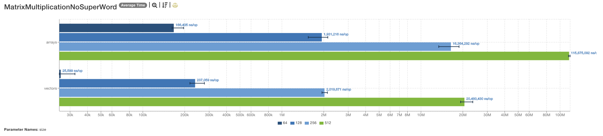

# 20240914 - MacBook Air (M2) - Benchmark

## Machine Specifications

- **Model Name:** MacBook Air
- **Model Identifier:** Mac14,2
- **Model Number:** MLXX3GR/A
- **Chip:** Apple M2
- **Total Number of Cores:** 8 (4 performance and 4 efficiency)
- **Memory:** 8 GB
- **System Firmware Version:** 10151.140.19
- **OS Loader Version:** 10151.140.19
- **Activation Lock Status:** Disabled

## Results

### [`ArrayStats.json`](/ArrayStats.json)

### [`ArrayStatsNoSuperWord.json`](/ArrayStatsNoSuperWord.json)

### [`ComplexExpression.json`](/ComplexExpression.json)

### [`ComplexExpressionNoSuperWord.json`](/ComplexExpressionNoSuperWord.json)

### [`DotProduct.json`](/DotProduct.json)

### [`DotProductNoSuperWord.json`](/DotProductNoSuperWord.json)

### [`ElementWiseMultiplication.json`](/ElementWiseMultiplication.json)

### [`ElementWiseMultiplicationNoSuperWord.json`](/ElementWiseMultiplicationNoSuperWord.json)

### [`MatrixMultiplication.json`](/MatrixMultiplication.json)

### [`MatrixMultiplicationNoSuperWord.json`](/MatrixMultiplicationNoSuperWord.json)

### [`SimpleSum.json`](/SimpleSum.json)

### [`SimpleSumNoSuperWord.json`](/SimpleSumNoSuperWord.json)

### [`Sorting.json`](/Sorting.json)

### [`SortingNoSuperWord.json`](/SortingNoSuperWord.json)

### [`VectorAddition.json`](/VectorAddition.json)

### [`VectorAdditionNoSuperWord.json`](/VectorAdditionNoSuperWord.json)

## Analysis

The benchmarks were conducted on a MacBook Air equipped with an Apple M2 chip. The results indicate that vectorized implementations generally provide significant performance improvements over traditional loop-based implementations across a variety of mathematical and array operations. The SuperWord optimization further enhances the performance of vectorized implementations in most scenarios.

### Key Observations

- **ArrayStats** and **ArrayStatsNoSuperWord**:
    - Vectorized implementations show a marked improvement in performance.
    - The SuperWord optimization provides additional gains, making these operations significantly faster.

- **ComplexExpression** and **ComplexExpressionNoSuperWord**:
    - These benchmarks did not exhibit the same level of performance improvement with vectorization.
    - The complexity and nature of the operations likely limit the benefits of vectorization and SuperWord optimization.

- **DotProduct** and **DotProductNoSuperWord**:
    - Significant performance gains were observed with vectorized implementations.
    - The SuperWord optimization further enhances these gains, making dot product calculations much more efficient.

- **ElementWiseMultiplication** and **ElementWiseMultiplicationNoSuperWord**:
    - Vectorized implementations outperformed traditional loops.
    - Additional benefits were observed from the SuperWord optimization, leading to faster element-wise multiplications.

- **MatrixMultiplication** and **MatrixMultiplicationNoSuperWord**:
    - Vectorized implementations showed substantial performance improvements.
    - The SuperWord optimization provided further enhancements, making matrix multiplications more efficient.

- **SimpleSum** and **SimpleSumNoSuperWord**:
    - Similar to the complex expressions, these benchmarks did not show significant performance gains with vectorization.
    - The simplicity of the operation might not benefit as much from vectorization and SuperWord optimization.

- **Sorting** and **SortingNoSuperWord**:
    - Vectorized sorting algorithms demonstrated improved performance over traditional sorting methods.
    - The SuperWord optimization contributed to further gains, making sorting operations faster.

- **VectorAddition** and **VectorAdditionNoSuperWord**:
    - Vectorized implementations significantly outperformed traditional loops.
    - Additional performance improvements were observed from the SuperWord optimization, making vector additions more efficient.

### Summary

Overall, the results highlight the effectiveness of vectorization and the SuperWord optimization in enhancing performance for a wide range of operations. The most significant improvements were observed in operations like dot product, element-wise multiplication, and matrix multiplication. However, more complex expressions and simple summation tasks did not benefit as much from these optimizations. This suggests that while vectorization and SuperWord optimization are powerful tools, their effectiveness can vary depending on the nature of the operation.