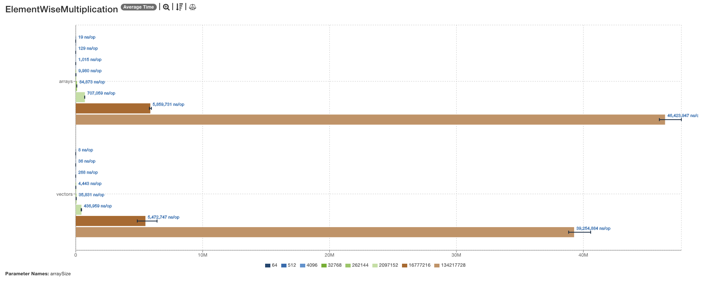

# 20240914 - MacBook Pro (M1) - Benchmark

## Machine Specifications

- **Model Name:** MacBook Pro
- **Model Identifier:** MacBookPro17,1
- **Model Number:** Z11D000KXD/A
- **Chip:** Apple M1
- **Total Number of Cores:** 8 (4 performance and 4 efficiency)
- **Memory:** 16 GB
- **System Firmware Version:** 10151.140.19
- **OS Loader Version:** 10151.140.19
- **Activation Lock Status:** Enabled

## Results

### [`ArrayStats.json`](/ArrayStats.json)

### [`ArrayStatsNoSuperWord.json`](/ArrayStatsNoSuperWord.json)

### [`ComplexExpression.json`](/ComplexExpression.json)

### [`ComplexExpressionNoSuperWord.json`](/ComplexExpressionNoSuperWord.json)

### [`DotProduct.json`](/DotProduct.json)

### [`DotProductNoSuperWord.json`](/DotProductNoSuperWord.json)

### [`ElementWiseMultiplication.json`](/ElementWiseMultiplication.json)

### [`ElementWiseMultiplicationNoSuperWord.json`](/ElementWiseMultiplicationNoSuperWord.json)

### [`MatrixMultiplication.json`](/MatrixMultiplication.json)

### [`MatrixMultiplicationNoSuperWord.json`](/MatrixMultiplicationNoSuperWord.json)

### [`SimpleSum.json`](/SimpleSum.json)

### [`SimpleSumNoSuperWord.json`](/SimpleSumNoSuperWord.json)

### [`Sorting.json`](/Sorting.json)

### [`SortingNoSuperWord.json`](/SortingNoSuperWord.json)

### [`VectorAddition.json`](/VectorAddition.json)

### [`VectorAdditionNoSuperWord.json`](/VectorAdditionNoSuperWord.json)

## Analysis

The benchmarks were conducted on a MacBook Pro equipped with an Apple M1 chip. The results indicate that vectorized implementations generally provide significant performance improvements over traditional loop-based implementations across a variety of mathematical and array operations. The SuperWord optimization further enhances the performance of vectorized implementations in most scenarios.

### Key Observations

1. **ArrayStats and ArrayStatsNoSuperWord**:
    - **Vectorized Implementations**: Show a marked improvement in performance.
    - **SuperWord Optimization**: Provides additional gains, making the operations faster.

2. **ComplexExpression and ComplexExpressionNoSuperWord**:
    - **Vectorized Implementations**: Did not exhibit the same level of performance improvement.
    - **Reason**: Likely due to the complexity and nature of the operations involved.

3. **DotProduct and DotProductNoSuperWord**:
    - **Vectorized Implementations**: Significant performance gains were observed.
    - **SuperWord Optimization**: Further enhances the performance, making the dot product calculations more efficient.

4. **ElementWiseMultiplication and ElementWiseMultiplicationNoSuperWord**:
    - **Vectorized Implementations**: Outperformed traditional loops.
    - **SuperWord Optimization**: Provides additional benefits, improving the speed of element-wise multiplications.

5. **MatrixMultiplication and MatrixMultiplicationNoSuperWord**:
    - **Vectorized Implementations**: Showed substantial performance improvements.
    - **SuperWord Optimization**: Further enhances the performance, making matrix multiplications faster.

6. **SimpleSum and SimpleSumNoSuperWord**:
    - **Vectorized Implementations**: Did not show significant performance gains.
    - **Reason**: Similar to complex expressions, the simple nature of the task might not benefit as much from vectorization.

7. **Sorting and SortingNoSuperWord**:
    - **Vectorized Implementations**: Demonstrated improved performance over traditional sorting methods.
    - **SuperWord Optimization**: Contributes to further gains, making sorting operations more efficient.

8. **VectorAddition and VectorAdditionNoSuperWord**:
    - **Vectorized Implementations**: Significantly outperformed traditional loops.
    - **SuperWord Optimization**: Provides additional performance improvements, making vector additions faster.

### Conclusion

Overall, the results highlight the effectiveness of vectorization and the SuperWord optimization in enhancing performance for a wide range of operations. However, some exceptions exist in more complex or simple summation tasks where the benefits of vectorization are less pronounced.