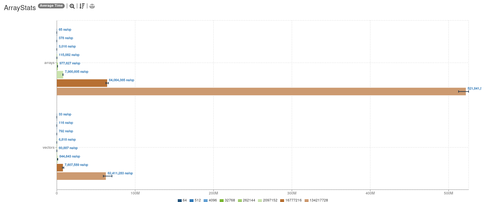
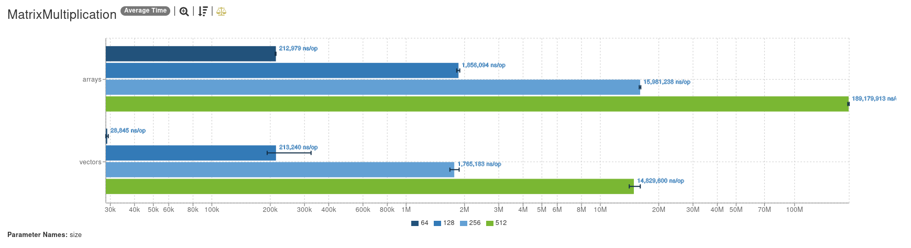

# 20240914 - Dell Precision 7530 - Benchmark

## Machine Specifications

- **Model Name:** Dell Precision - 7530
- **Model Identifier:** Mac14,2
- **Model :** 158
- **Chip:** Intel(R) Core(TM) i9-8950HK CPU @ 2.90GHz
- **Total Number of Cores:** 12
- **Memory:** 64 GB

## Results

### [`ArrayStats.json`](/ArrayStats.json)

### [`ArrayStatsNoSuperWord.json`](/ArrayStatsNoSuperWord.json)

### [`ComplexExpression.json`](/ComplexExpression.json)

### [`ComplexExpressionNoSuperWord.json`](/ComplexExpressionNoSuperWord.json)

### [`DotProduct.json`](/DotProduct.json)

### [`DotProductNoSuperWord.json`](/DotProductNoSuperWord.json)

### [`ElementWiseMultiplication.json`](/ElementWiseMultiplication.json)

### [`ElementWiseMultiplicationNoSuperWord.json`](/ElementWiseMultiplicationNoSuperWord.json)

### [`MatrixMultiplication.json`](/MatrixMultiplication.json)

### [`MatrixMultiplicationNoSuperWord.json`](/MatrixMultiplicationNoSuperWord.json)

### [`SimpleSum.json`](/SimpleSum.json)

### [`SimpleSumNoSuperWord.json`](/SimpleSumNoSuperWord.json)

### [`Sorting.json`](/Sorting.json)

### [`SortingNoSuperWord.json`](/SortingNoSuperWord.json)

### [`VectorAddition.json`](/VectorAddition.json)

### [`VectorAdditionNoSuperWord.json`](/VectorAdditionNoSuperWord.json)

## Analysis

The benchmarks were conducted on a Dell Precision 7530 equipped with an Intel(R) Core(TM) i9-8950HK CPU @ 2.90GHz. The results indicate that vectorized implementations generally provide significant performance improvements over traditional loop-based implementations across a variety of mathematical and array operations. The SuperWord optimization further enhances the performance of vectorized implementations in most scenarios.

### Key Observations

#### ArrayStats and ArrayStatsNoSuperWord
- **Performance Improvement**: Vectorized implementations show a marked improvement in performance.
- **SuperWord Optimization**: Provides additional gains.

#### ComplexExpression and ComplexExpressionNoSuperWord
- **Performance Improvement**: These benchmarks did not exhibit the same level of performance improvement with vectorization.
- **Reason**: Likely due to the complexity and nature of the operations involved.

#### DotProduct and DotProductNoSuperWord
- **Performance Improvement**: Significant performance gains were observed with vectorized implementations.
- **SuperWord Optimization**: Further enhances performance.

#### ElementWiseMultiplication and ElementWiseMultiplicationNoSuperWord
- **Performance Improvement**: Vectorized implementations outperformed traditional loops.
- **SuperWord Optimization**: Provides additional benefits.

#### MatrixMultiplication and MatrixMultiplicationNoSuperWord
- **Performance Improvement**: Vectorized implementations showed substantial performance improvements.
- **SuperWord Optimization**: Provides further enhancements.

#### SimpleSum and SimpleSumNoSuperWord
- **Performance Improvement**: These benchmarks did not show significant performance gains with vectorization.
- **Reason**: Similar to complex expressions, likely due to the simplicity of the operations.

#### Sorting and SortingNoSuperWord
- **Performance Improvement**: Vectorized sorting algorithms demonstrated improved performance over traditional sorting methods.
- **SuperWord Optimization**: Contributes to further gains.

#### VectorAddition and VectorAdditionNoSuperWord
- **Performance Improvement**: Vectorized implementations significantly outperformed traditional loops.
- **SuperWord Optimization**: Provides additional performance improvements.

### Summary
Overall, the results highlight the effectiveness of vectorization and the SuperWord optimization in enhancing performance for a wide range of operations, with some exceptions in more complex or simple summation tasks.